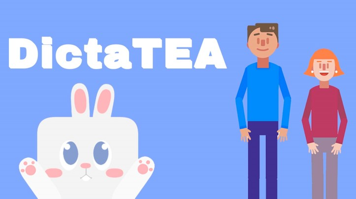
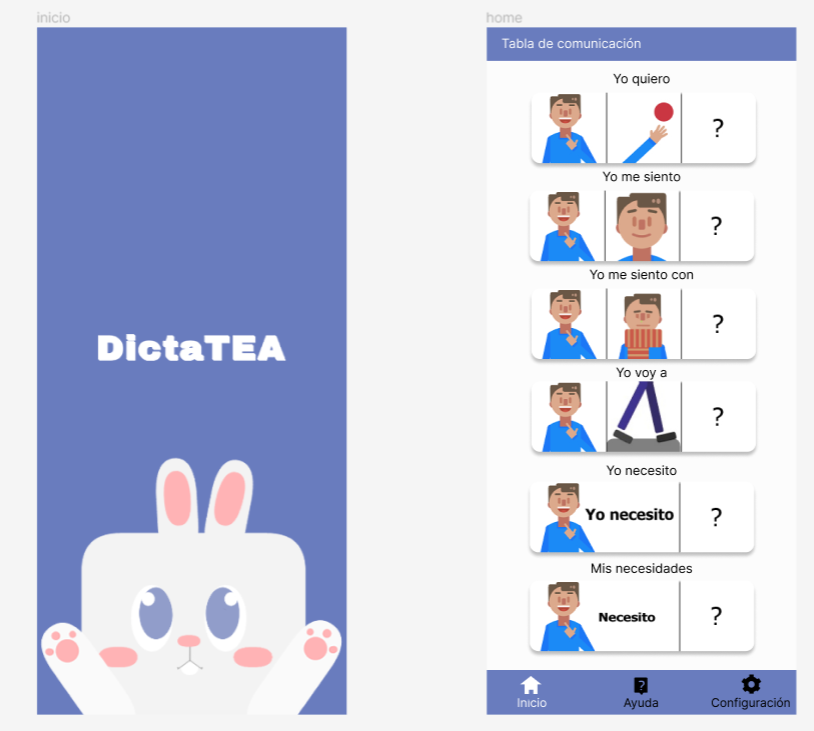
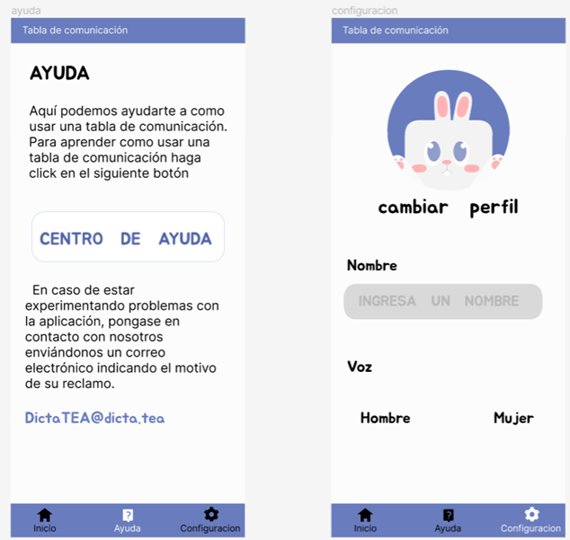
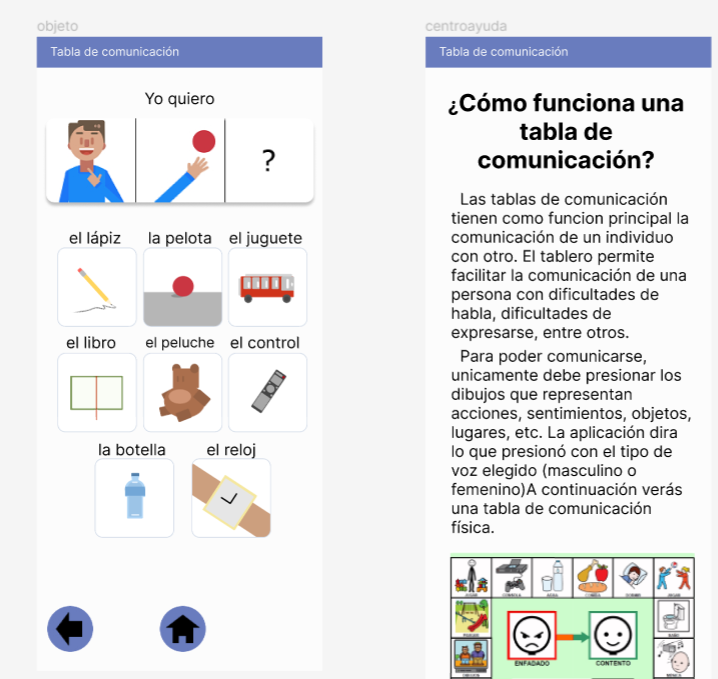
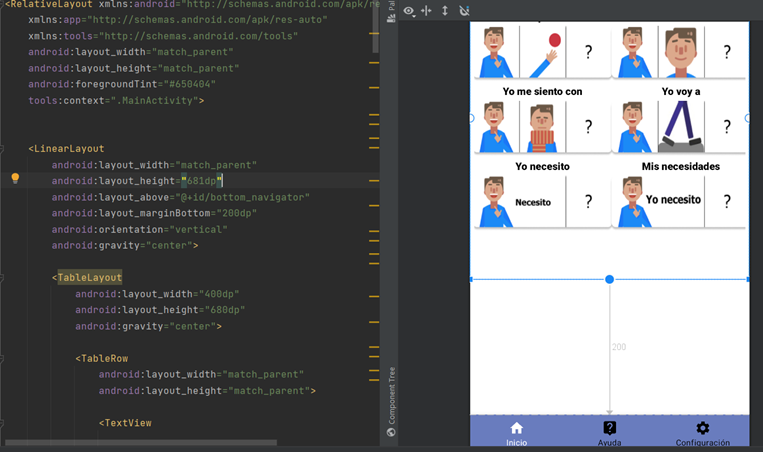

# DictaTEA




## EN

**DictaTEA** is an Android application designed to assist children with autism spectrum disorder (ASD) who face communication challenges. The app digitalizes a communication board to help these children select what they want to express, and the app will emit the corresponding sound.

### Objectives

**General Objective:**
- Develop a mobile application capable of transmitting emotions, needs information, and alerts through pictograms.

**Specific Objectives:**
- Improve the quality of life for patients with ASD.
- Enable caregivers of patients with ASD to understand and engage in conversation with the user.
- Update the standard pictograms used in the market with intuitive icons that are friendly for ASD patients underage.

### Features

- **Digital Communication Board:** A virtual board for selecting and expressing needs or wants.
- **Sound Output:** Each selection triggers a corresponding sound.
- **User-Friendly Interface:** Designed with simplicity in mind to cater to the needs of children.

### Screenshots

Here are some screenshots of the DictaTEA application:

  
Loading and Home Screen

  
Help and Settings Menu

  
Pictogram Tables and Tutorial

  
Development Process

### Installation

To install and run DictaTEA locally:

1. **Clone the Repository:**
    ```bash
    git clone https://github.com/Gatorrante/DictaTEAapp.git
    ```
2. **Open the Project in Android Studio.**
3. **Build and Run the Application.**

### Usage

- Open the application on your Android device.
- Navigate through the digital board to select the desired option.
- The app will play the sound associated with the selection.

### Contributing

We welcome contributions to improve DictaTEA. To contribute:

1. Fork the repository.
2. Create a feature branch (`git checkout -b feature/YourFeature`).
3. Commit your changes (`git commit -am 'Add new feature'`).
4. Push to the branch (`git push origin feature/YourFeature`).
5. Create a new Pull Request.

### Credits

- **Design Credits:** Special thanks to [@Bazgart22](https://x.com/Bazgart22) for the design of the cards used in the communication board.


### Badges


---

## ES

**DictaTEA** es una aplicación desarrollada en Android que ayuda a niños con síndrome del espectro autista (TEA) que tienen problemas para comunicarse. La aplicación digitaliza un tablero de comunicación, permitiendo a estos niños seleccionar lo que desean expresar, y la app emitirá el sonido correspondiente.

### Objetivos

**Objetivo General:**
- Desarrollar una aplicación móvil capaz de transmitir emociones, información de necesidades y alertas a través de pictogramas.

**Objetivos Específicos:**
- Mejorar la calidad de vida de los pacientes con TEA.
- Lograr que los apoderados de los pacientes con TEA puedan entender y entablar una conversación con el usuario.
- Actualizar los pictogramas estándar usados en el mercado con iconos intuitivos que sean amigables para los pacientes con TEA menores de edad.

### Características

- **Tablero de Comunicación Digital:** Un tablero virtual para seleccionar y expresar necesidades o deseos.
- **Salida de Sonido:** Cada selección activa un sonido correspondiente.
- **Interfaz Amigable:** Diseñada con simplicidad en mente para atender las necesidades de los niños.

### Capturas de Pantalla

Aquí tienes algunas capturas de pantalla de la aplicación DictaTEA:

  
Pantalla de Carga y Principal

  
Menú de Ayuda y Configuraciones

  
Tablas de Pictogramas y Tutorial

  
Proceso de Desarrollo

### Instalación

Para instalar y ejecutar DictaTEA localmente:

1. **Clona el Repositorio:**
    ```bash
    git clone https://github.com/Gatorrante/DictaTEAapp.git
    ```
2. **Abre el Proyecto en Android Studio.**
3. **Construye y Ejecuta la Aplicación.**

### Uso

- Abre la aplicación en tu dispositivo Android.
- Navega a través del tablero digital para seleccionar la opción deseada.
- La app reproducirá el sonido asociado con la selección.

### Contribuciones

Estamos abiertos a contribuciones para mejorar DictaTEA. Para contribuir:

1. Haz un fork del repositorio.
2. Crea una rama de función (`git checkout -b feature/TuFunción`).
3. Comete tus cambios (`git commit -am 'Añadir nueva función'`).
4. Empuja a la rama (`git push origin feature/TuFunción`).
5. Crea una nueva Pull Request.

### Créditos

- **Créditos de Diseño:** Agradecimientos a [@Bazgart22](https://x.com/Bazgart22) por el diseño de las tarjetas usadas en el tablero de comunicación.


### Badges


